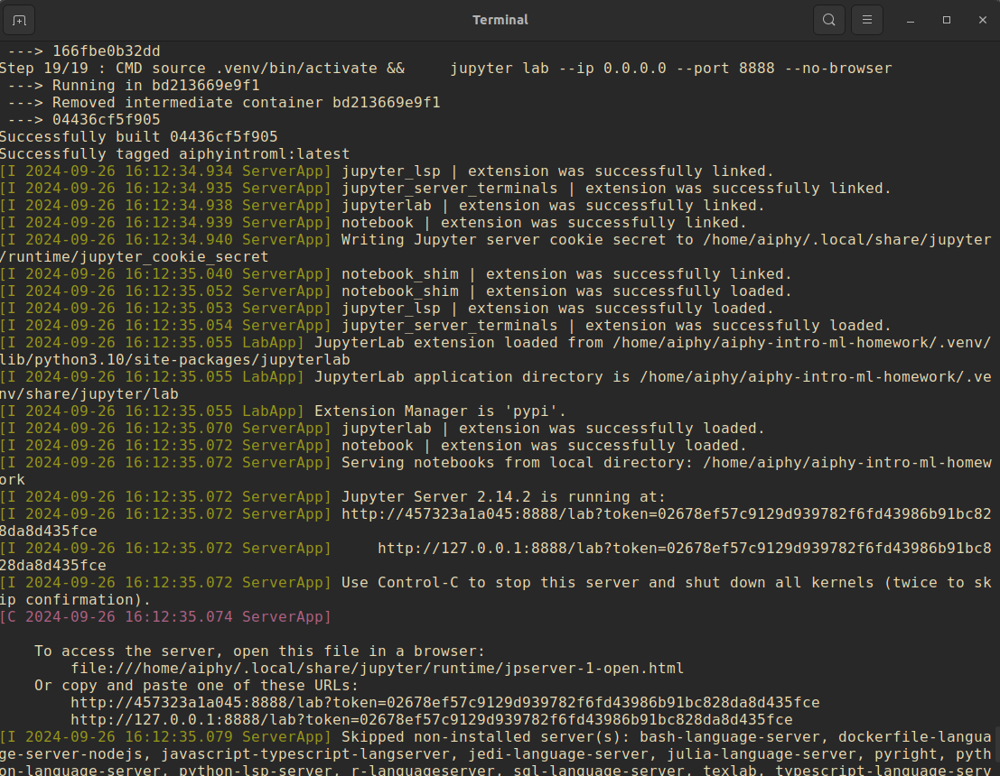

# Machine Learning Elements

> **Author**: [Riccardo Finotello](riccardo.finotello@cea.fr) (CEA Paris-Saclay)
>
> **Event**: _Artificial Intelligence and Modern Physics. A Two-Way Connection._


The repository contains the presentation given in the context of the doctoral school _AIPHY_ (_Artificial Intelligence and Modern Physics. A Two-Way Connexion_, Monopoli, Bari, Italy), from 30/09/2024 to 04/10/2024, for the course of **Machine Learning Elements**.
Hands-on sessions are presented as _Jupyter_ notebooks.

## Installation

The best way to use the material is to install it locally on your machine.
However, multiplle options are at your disposal.

> [!WARNING] Graphical Output
> The dependency `graphviz` is optional, but used to generate a visual representation of the neural networks. If you would like to use it, make sure to install the binaries (e.g. `sudo apt install graphviz`) on your machine.

### Online Use

If you have a good internet connection, you can launch the repository directly in an online _Jupyter_ server using this [link](https://mybinder.org/v2/gh/thesfinox/aiphy-intro-ml-homework/HEAD) or clicking on the button below:

[](https://mybinder.org/v2/gh/thesfinox/aiphy-intro-ml-homework/HEAD)

> [!WARNING] Binder
> Binder is an online service which enables using _Jupyter_ notebooks on a shared virtual machine. It automatically installs the dependencies in the _requirements.txt_ file. However, it might be slow to use, and strongly dependent on the quality of your connexion.

### Docker Installation

> [!NOTE] Docker installation
> See these [instructions](https://docs.docker.com/get-started/get-docker/) for more details on how to install Docker on your machine.

The simplest installation is via the _Docker_ [image](https://hub.docker.com/repository/docker/thesfinox/aiphy-intro-ml-homework), especially if you work under a _Windows_ OS, since all dependencies are automatically taken care of.
From a terminal, run the following commands (or follow the GUI instructions):

```bash
docker pull thesfinox/aiphy-intro-ml-homework
docker run -p 8888:8888 --rm -it  thesfinox/aiphy-intro-ml-homework
```
then look for the link `http://127.0.0.1:8888/...` in the output, and open it in your browser (e.g. see at the bottom of the image).



Alternatively, you can build and run the Docker image using the [Dockerfile](./aiphyintroml.dockerfile).

### Virtual Environment

You can clone (or [download](https://github.com/thesfinox/aiphy-intro-ml-homework/releases)) the repository, and install the dependencies yourself:

```bash
python -m venv .venv
source .venv/bin/activate
python -m ensurepip --upgrade
python -m pip install -r requirements.txt
jupyter lab
```

## Contributing

Everyone is welcome to share their suggestions by:

1. **forking** the repository;
2. submitting a **pull request**.
